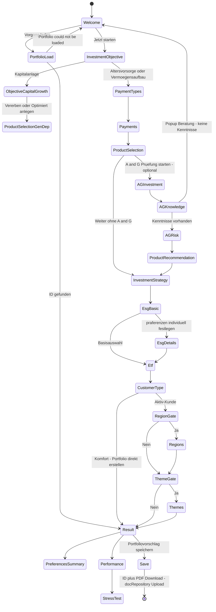
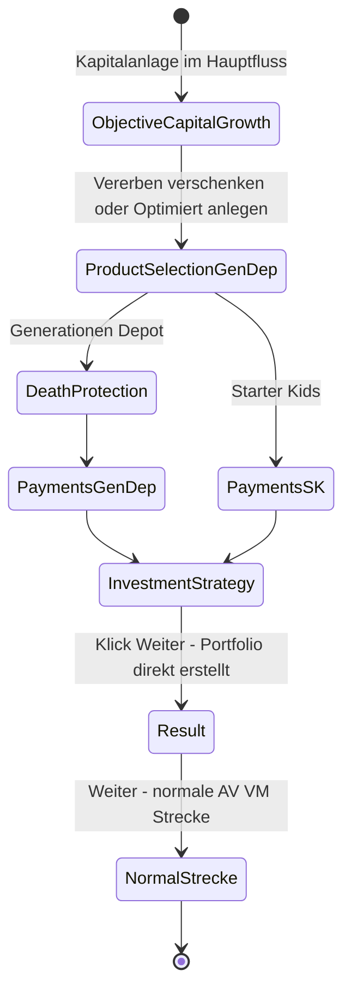

# User Journey — Mein Fondskompass (Distillation)

> **Status:** living specification · distilled 2026-09-02 from the Provinzial journey sources
> **Scope:** click-flow only — screen sequence, gating, and interactions. **No** branding, corporate design, or visual styling decisions (exception: the 4-colour-theme URL mechanism is recorded in [D-18](#d-18) because it defines an entry-channel behaviour).

This directory is the consolidated, screen-by-screen contract for the *Mein Fondskompass* guided journey. It cross-maps four sources into one view:

| # | Source | Path | Role |
|---|--------|------|------|
| 1 | Commented journey PDF (PK, 2026-08-27) | `notes/Provinzial-Journey_Commented_PK-2026-08-27.pdf` | **Product intent** — screen inventory with original screen IDs (`ID: InvestmentObjective`, `ID: PaymentTypes`, …) and decision annotations (`only "Ja"`, `show recommendation …`, `only for "Aktiv-Kunde"`) |
| 2 | Klickstrecke PPT text dump (2026-07-24, 42 slides + notes) | `notes/pptx_klickstrecke_text.txt` | **Product intent** — wording, option lists, mouseover texts, Hinweise/notes (risk-volatility bounds, A&G mapping table, budget rule, entry-channel skip rule, error popups) |
| 3 | Prototype flow configs | `flows/variantA.json`, `flows/variantB.json` | **Early prototype subset** — variant A = linear (all steps shown), variant B = gated (Komfort skip, region/theme Ja/Nein gates) |
| 4 | Prototype renderer | `static/js/app.js` + `templates/index.html` | **Early prototype subset** — flow wizard, budget/showIf enforcement, result tabs. Emits **no** `data-testid` attributes today |

Supporting implementation facts: [`preferences_schema.json`](../../preferences_schema.json) (option values, `preference_gating` budget), [`funds_portfolio/portfolio/risk_bands.py`](../../funds_portfolio/portfolio/risk_bands.py) (engine bands), [`funds_portfolio/dialog/feasibility.py`](../../funds_portfolio/dialog/feasibility.py) (answer-space shaping).

**Framing rule:** where PDF/PPT and the prototype disagree, **PDF/PPT is the current product intent** and the prototype is an early subset. Every disagreement is logged in the [divergence list](#gaps--product-decisions) with a decision owner marker.

---

## Documents in this directory

| Document | Content |
|----------|---------|
| [`README.md`](README.md) | this overview: journey model, state diagrams, coverage matrix, gaps & product decisions |
| [`screens.md`](screens.md) | per-screen specification S-01 … S-24: intent, entry/exit, gating, interaction tables with `data-testid`, PPT Hinweise/Mouseover as spec annotations |
| [`testids.md`](testids.md) | `data-testid` convention and full inventory — the selector **contract** for UI automation (nothing implemented yet in [`app.js`](../../static/js/app.js)) |

---

## Status vocabulary

| Status | Meaning |
|--------|---------|
| **IMPLEMENTED** | behaviour exists and works in the prototype (wording deviations acceptable) |
| **PARTIAL** | screen/behaviour exists but is missing spec'd elements (listed per row) |
| **PLANNED** | spec'd in PDF/PPT only; no prototype counterpart |

---

## Entry channels

The PPT defines three entry channels with a skip rule (repeated on slides 3, 4, 5, 6, 7, 33, …):

> *"Seite nur in der Endkunden Webversion relevant. Wenn Aufruf aus Tarifrechner oder perspektivisch Online Sales Strecke erfolgt wird diese nicht angezeigt."*

| Channel | Commercial screens (Anlageziel → Produktwahl) | Product | A&G |
|---------|------------------------------------------------|--------|-----|
| **Endkunden web** (default) | shown | customer picks FRV/GRV | optional button |
| **Tarifrechner / Berater** (PDF: *"Einstieg über Tarifrechner für Beater") | **skipped** | provided via payload (`ID: PensionInsuranceProductSelection`) — *"Currently wont work because Tarifrechner do not support the info, so this is for later"* | jump to *next step Risiko* |
| **LeAn handover** (2027, PPT slide 1: *"Datenübergabe von LeAn in den MFK für 2027 geplant"*) | skipped | Produkt + A&G-Ergebnisse + Maskendesign transmitted | result reused |

The prototype does **not** model channels — every flow step is always reachable (→ [D-10](#d-10)).

---

## Journey model — main flow

## Journey model — Kapitalanlage branch (Generationen Depot / Starter Kids)

Notes on the diagrams:

- `InvestmentObjective` shows only `Altersvorsorge` / `Vermögensaufbau` in the main path; `Kapitalanlage` swaps in the two alternative cards *Vererben/verschenken* and *Optimiert anlegen* (PDF `ID: InvestmentObjectiveCapitalGrowth`; PPT slides 31/35).
- `Payments` (PDF `ID: Payments`) is reduced to the one-off amount in the GenDep/StarterKids branch (PPT slides 32/38/41).
- The A&G block (`AGInvestment` → `AGKnowledge` → `AGRisk`) is the *Angemessenheits- & Geeignetheitsprüfung*; its result drives `ProductRecommendation` (PDF `ID: PensionInsuranceVarioTypeRecommendation`) and pre-selects `InvestmentStrategy` (PDF `ID: InvestmentStrategyRecommendation`).
- GenDep + Todesfallschutz restricts the fund universe (*"bei GenDep mit TFS gibt es nur ein eingeschränktes Fondsportfolio"*, PPT slide 37).

---

## Coverage matrix

Legend — **Screen**: canonical slug used in [`screens.md`](screens.md) and [`testids.md`](testids.md) · **PDF-ID**: screen ID from the commented PDF · **PPT**: slide numbers in `notes/pptx_klickstrecke_text.txt` · **Flow**: step id in [`flows/variantA.json`](../../flows/variantA.json) / [`flows/variantB.json`](../../flows/variantB.json).

| # | Screen | PDF-ID | PPT | Flow step | Status | Missing vs. spec |
|---|--------|--------|-----|-----------|--------|------------------|
| S-01 | `welcome` | — | 1–2 | — *(welcome-view)* | **PARTIAL** | no Kontakt / Beratung / Feedback links; no 4-theme URL switch ([D-18](#d-18)) |
| S-02 | `portfolio-load` | *"Please insert your Portfolio ID"* | 1–2 | — *(resume-form)* | **IMPLEMENTED** | load-failure message exists (`resume-error`); wording differs |
| S-03 | `investment-objective` | `InvestmentObjective` | 3, 30, 34 (+ 31/35 alt wording) | `goal` | **PARTIAL** | 3 options only; `Kapitalanlage` does not branch to Vererben/Optimiert ([D-16](#d-16)); entry-channel skip not modeled ([D-10](#d-10)) |
| S-04 | `payment-types` | `PaymentTypes` | 4 | `payment` | **IMPLEMENTED** | — (channel skip missing, [D-10](#d-10)) |
| S-05 | `payments` | `Payments` | 5, 32, 38, 41 | `contribution` | **PARTIAL** | no Laufzeit slider (12–50+ J, default 30); no Tarifrechner min/max prefill; no StarterKids bounds 25–200 € / 250–999.999 € ([D-09](#d-09), [D-16](#d-16)) |
| S-06 | `product-selection` | `PensionInsuranceVarioType` (+ `PensionInsuranceProductSelection` payload entry) | 6, 7, 33 (+ 12, 36, 40 variants) | `product` | **PARTIAL** | no A&G launch button; no Produktinformationsblatt/A&G mouseovers; no payload/product-provided mode; no GenDep/StarterKids cards |
| S-07 | `ag-investment` | — *(A&G block)* | 8 | — | **PLANNED** | whole screen; Vermögensübertrag → wrong-journey popup (*"Pop Up aka falsche Strecke"*) |
| S-08 | `ag-knowledge` | — | 9 | — | **PLANNED** | whole screen + error popup *"keine Kenntnisse"* → Berater/Agentur |
| S-09 | `ag-risk` | — | 10–11 | — | **PLANNED** | 4×2 question matrix; A&G mapping table (see [D-11](#d-11)) |
| S-10 | `product-recommendation` | `PensionInsuranceVarioTypeRecommendation` | 12 | — | **PLANNED** | recommendation badge *"Empfehlung gemäß Mapping in A&G"* |
| S-11 | `investment-strategy` | `InvestmentStrategy` / `InvestmentStrategyRecommendation` | 13, 39, 42 | `risk` → section `risk_approach` | **PARTIAL** | no A&G-based recommendation/preselection; no mouseover vol texts 8/15/30 %; open spec questions ([D-06](#d-06), [D-11](#d-11)) |
| S-12 | `esg-basic` | `EsgBasic` *(once `EsgBasics` — [D-17](#d-17))* | 14–16 | `esg` → section `esg_preference` | **PARTIAL** | no confirm popup for strict selection (slide 16); entry to details screen missing |
| S-13 | `esg-details` | `EsgDetails` | 17–18 | — | **PLANNED** | regulatory question set; shown *"only when clicking on präferenzen festlegen"*; error popup *"zu wenig Fonds"* → Berater finden ([D-12](#d-12)) |
| S-14 | `etf` | `ETF` | 19 | `etf` → section `etf_preference` | **PARTIAL** | 3 mouseover info texts not rendered; PDF annotates *"only for Komfort"* ([D-08](#d-08)) |
| S-15 | `customer-type` | `CustomerType` | 20 | `activity` | **IMPLEMENTED** | Komfort → direct result works via `showIf` in variant B |
| S-16 | `region-gate` | — *(annotation `only for "Aktiv-Kunde"`)* | 21 | `region_gate` (B only) | **IMPLEMENTED** | variant A shows regions ungated |
| S-17 | `regions` | `RegionTypes` *(also `Regions`)* | 22 | `regions` | **PARTIAL** | `max: 2` vs. spec max 1 ([D-01](#d-01)); DEF exclusion of Asia/Emerging soft, not hard ([D-05](#d-05)); budget DEF1/BAL2/OPP3 enforced |
| S-18 | `theme-gate` | `Industries` | 23 | `themes_gate` (B only) | **IMPLEMENTED** | — |
| S-19 | `themes` | `IndustryTypes` | 24 | `themes` | **PARTIAL** | DEF must be 0 themes vs. budget 1 ([D-02](#d-02)); label/value mapping divergences ([D-07](#d-07)); 10 mouseover texts not rendered |
| S-20 | `result` | *"Ihr Beispiel Portfolio"* | 25, 29 | — *(finalizeFlow → results-view)* | **PARTIAL** | 5 tabs spec'd vs. 4 built; no per-fund exchange/delete dots; Anlageprofil zoom without themes breakdown |
| S-21 | `preferences-summary` | — | 26 | — *(Preferences tab)* | **PARTIAL** | spec lists Investmentstrategie row; depends on [D-11](#d-11) |
| S-22 | `performance` | — | 27 | — *(Performance tab)* | **PARTIAL** | periods 3J/5J/10J spec'd (prototype: 1y/3y/5y/10y/si); Inflation −2,67 % & Kosten −0,16 % display |
| S-23 | `stress-test` | — | 28 | — *(Performance tab overlay)* | **PARTIAL** | COVID-19 / INFLATION presets via `data/stress_periods.json`; spec wording differs |
| S-24 | `save` | *"HERE IS YOUR ID + PDF DOWNLOAD"* | — | — *(portfolio persistence)* | **PARTIAL** | UUID + JSON persistence built; **no** PDF download, **no** docRepository upload ([D-15](#d-15)) |
| S-25 | `death-protection` | `DeathProtection` | 37 | — | **PLANNED** | GenDep-branch only; restricts fund universe with TFS=Ja |
| S-26 | `objective-capital-growth` / `product-selection-gendep` / `payments` branch | `InvestmentObjectiveCapitalGrowth`, `Payments` | 31/35, 36/40, 32/38/41 | — | **PLANNED** | whole Kapitalanlage branch ([D-16](#d-16)) |

Prototype-only elements **not** in PDF/PPT: language switcher (`lang-select`), active-session banner, decision-trace (Quick-Mode), restart button. These stay prototype features unless promoted by product.

---

## Gaps & product decisions

Each item states: divergence, sources, current prototype behaviour, and the decision needed. IDs `D-xx` are stable references used across this directory.

### Selection-budget family (PPT slides 22 + 24, identical rule text)

> *"Anzahl der möglichen Präferenzen (Region und Thema) abhängig von Risikoprofil. Defensiv max. 1; Ausgewogen max. 2 (je max. 1 Region und max. 1 Thema); Chancenorientiert max. 3 (egal ob 2 Regionen und 1 Thema oder 1 Region und 2 Themen)."*

The prototype implements a **cross-dimension budget** in [`preferences_schema.json`](../../preferences_schema.json) `preference_gating` (`max_by_profile: DEFENSIVE 1 / BALANCED 2 / OPPORTUNITY 3`, enforced in [`app.js`](../../static/js/app.js) with drop-from-end semantics) plus **per-section** `max` (regions 2, themes 2). The per-dimension composition rules are **not** encoded.

#### D-01 — Regions max: spec 1 vs. schema 2
- **Spec:** PPT slide 22 *"Maximal 1 Regionen auswählbar"*; PDF `ID: RegionTypes` same. BAL budget *"je max. 1 Region"*.
- **Prototype:** `preferred_regions.max = 2`; OPP budget even invites 2 regions + 1 theme.
- **Decision:** keep schema `max: 2` + budget (then slide 22 wording must change) **or** hard-cap regions at 1 for all profiles.

#### D-02 — DEFENSIVE must not select themes
- **Spec:** PPT slide 24 *"Bei Auswahl Risikoprofil Zurückhaltend ist eine Themenauswahl nicht möglich"* (→ DEF = max 1 **region**, 0 themes).
- **Prototype:** budget DEFENSIVE = 1 allows exactly 1 theme or 1 region.
- **Decision:** encode `themes_max_by_profile: DEFENSIVE 0` (or a general per-field budget vector) vs. accept 1 theme for DEF.

#### D-03 — BALANCED composition: 1 Region + 1 Thema only
- **Spec:** *"Ausgewogen max. 2 (je max. 1 Region und max. 1 Thema)"* → only 1R+1T.
- **Prototype:** allows 2R+0T and 0R+2T (per-section `max: 2`, budget 2).
- **Decision:** per-field caps (`regions ≤ 1 ∧ themes ≤ 1` for BAL) vs. generic budget.

#### D-04 — OPPORTUNITY composition
- **Spec:** *"max. 3 (egal ob 2 Regionen und 1 Thema oder 1 Region und 2 Themen)"* — matches budget 3 + per-section max 2.
- **Status:** effectively aligned; only threatened by whichever outcome of [D-01](#d-01) is chosen.

#### D-05 — DEF region exclusion: Asia/Pazifik & Schwellenländer
- **Spec:** PPT slide 22 *"Bei Auswahl Risikoprofil Zurückhaltend ist die Auswahl Asien/Pazifik und Schwellenländer nicht möglich."*
- **Prototype:** no hard per-option block; the feasibility advisor decorates options with feasible counts (cross-filter profile × ESG × ETF) and the UI warns — options are not disabled.
- **Decision:** hard-disable in UI (and advisor) vs. warn-only; also whether the exclusion should apply to BALANCED.

### Engine bounds

#### D-06 — OPPORTUNITY volatility bound 30 % is spec-only
- **Spec:** PPT slides 13/39/42 mouseover *"Chancenorientiert: Volatilität bis max. 30 % (5-Jahresdurchschnitt)"*; notesSlide13/14 repeat 8/15/30 %.
- **Engine:** [`risk_bands.py`](../../funds_portfolio/portfolio/risk_bands.py) — DEFENSIVE `vol_max 8.0`, BALANCED `vol_max 15.0`, **OPPORTUNITY `vol_max: None`** (SRRI 4–7 + `mdd_max 50` + `vol_min 10` only).
- **Decision:** add `vol_max 30.0` to OPPORTUNITY (then mouseover and engine agree) **or** declare the 30 % an informational hint only. Related open spec question on slide 13: *"Ausgestaltung bei GRV anders? Handling falls Zurückhaltend ausgewählt wird? Text Anpassung bei Zurückhaltend"*.

### Naming & vocabulary

#### D-07 — Theme label/value mapping (PPT DE ↔ schema EN)
PPT slide 24 labels vs. [`preferences_schema.json`](../../preferences_schema.json) values:

| PPT label | Schema option | Value |
|-----------|---------------|-------|
| Rohstoffe | Commodities & Raw Materials | `commodities` |
| **Ökologie & Erneuerbare Energie** | **Sustainability & Climate** | `sustainability` |
| Megatrends | Megatrends | `megatrends` |
| Gesundheit & Pflege | Healthcare & Life Sciences | `healthcare` |
| Infrastruktur | Infrastructure | `infrastructure` |
| KI & Robotics | AI & Robotics | `ai_robotics` |
| Sicherheit & Verteidigung | Security & Defense | `defense` |
| Wasser | Water | `water` |
| Technologie | Technology & Innovation | `technology` |
| Dividenden | Dividends | `dividends` |

- **Divergence:** *"Ökologie & Erneuerbare Energie"* (renewables/energy framing) ↔ *"Sustainability & Climate"* is a semantic mismatch, not just a translation. Additionally `response_schema.preferred_themes` still lists a stale **`energy`** enum value that has no option.
- **Decision:** rename the schema option to `renewable_energy`/`energy` (and align the enum), or accept the sustainability label and update the PPT wording.

#### D-08 — ETF screen audience: PDF says *"only for Komfort"*
- **Spec conflict:** PDF annotates the ETF screen (between ETF content and the activity question) with `only for "Komfort"`; PPT slide 19 places ETF **before** the Komfort/Aktiv question with no gating; flows ask `etf_preference` for everyone.
- **Decision:** is ETF preference collected for Aktiv customers too (they pick funds themselves later), or only for Komfort? Today: universal.

#### D-09 — Anlagedauer question missing
- **Spec:** PPT slides 5/41 *"Wie lange möchten Sie ihr Geld anlegen?"* slider 12 Jahre … 30 … 50 Jahre+ (plus *"Hinweis Alter höchstgrenze und falls unter 12 Jahre"*).
- **Prototype:** `contribution` step has only `beitragLaufend` / `beitragEinmalig`; no duration field anywhere in the schema.
- **Decision:** add `investment_horizon` to the questionnaire + flow, or drop it from the spec (it also appears inside A&G as *Anlagedauer* bands bis 12 / über 12 / über 20 Jahre — dedupe needed).

### Structural gaps

#### D-10 — Entry-channel skip rule not modeled
Slides 3–7/33: commercial screens are Endkunden-web-only; Tarifrechner/Online-Sales entries skip to product/strategy; product may arrive as payload (`PensionInsuranceProductSelection`, PDF: *"Currently wont work because Tarifrechner do not support the info"*). **Decision:** model `entry_channel` in the flow configs (e.g. `hideForChannel` on steps) + payload ingestion endpoint, or defer.

#### D-11 — A&G block & recommendation mapping unimplemented
PPT slide 11 mapping (risk-behaviour question 1–4 × loss-capacity question 1–2 → product + profile):

| Answers | Product | Risk profile |
|---------|---------|--------------|
| 1&1, 1&2, 2&1, 3&1 | GRV | Zurückhaltend |
| 2&2, 3&2 | GRV, alt FRV | Ausgewogen |
| 4&1 | GRV | Ausgewogen |
| 4&2 | FRV, alt GRV | Chancenorientiert |

Slide 11 note: *"Empfehlung Risikoprofil Zurückhaltend für GRV im Kern unsinnig"* — the mapping itself is flagged as questionable by product. **Decision:** implement A&G screens S-07…S-10 + `*Recommendation` screens, resolve the flagged row, and wire the recommendation into `investment-strategy` (PDF: `show recommendation "for persönliche Risikopräferenz" AND it was not asked before`).

#### D-12 — ESG popups missing
- Slide 16: warning popup on strict individual criteria (*"…kann sich die Anzahl der verfügbaren Fonds deutlich reduzieren… Wollen Sie dennoch fortfahren?"* → Weiter/Zurück).
- Slide 18: error popup when the fund universe collapses (*"…kein passendes Beispiel Portfolio generieren. Bitte passen Sie ihre Auswahl an, oder kontaktieren Sie einen Berater…"* → *Berater finden* / *Zurück*).
- **Prototype:** feasibility advisor returns soft warnings only. **Decision:** popup UX + threshold (fund count ≤ x) + advisor hard-fail mode.

#### D-13 — Direct-creation semantics
Slide 20 (Komfort) and slide 39 (StarterKids strategy): *"Bei Klick auf Weiter wird das Portfolio direkt erstellt."* Variant B implements the Komfort skip via `showIf`; the strategy-screen variant is not modeled. **Decision:** keep generic finalize, add per-step `autoFinish` flag if spec'd.

#### D-14 — Result screen fund actions
Slide 25: *"Über die Punkte können einzelne Fonds ausgetauscht oder gelöscht werden"* and *"Bei Aufklappen werden die Fondsinformationen angezeigt"*. **Prototype:** expandable rows exist; exchange/delete dots do not. **Decision:** scope of per-fund actions in the Beispiel-Portfolio.

#### D-15 — Save journey
PDF: *"HERE IS YOUR ID + PDF DOWNLOAD / Portfoliovorschlag speichern / Upload JSON to docRepository (Provinzial can call JSON by ID)"*. **Prototype:** UUID persistence + resume only. **Decision:** PDF render + docRepository contract.

#### D-16 — Kapitalanlage / Generationen Depot / Starter Kids branch
Slides 31/35 (`InvestmentObjectiveCapitalGrowth`: Vererben/verschenken, Optimiert anlegen), 36/40 (GenDep/StarterKids product cards), 37 (`DeathProtection` — TFS restricts fund universe), 32/38 (one-off min/max from Tarifrechner), 41 (StarterKids bounds: Sparrate min 25 € preselected, **max 200 €/month**; Einmalbeitrag **250–999.999 €**; Laufzeit 12–50+ J). None of this exists in the prototype. Also open: slide 8 *"Bei vermögensübertrag empfiehlt der Tarifrechner das Generationendepot"* + wrong-journey popup. **Decision:** branch priority and whether StarterKids needs its own risk-screen copy (slide 42).

#### D-17 — PDF screen-ID inconsistencies
`EsgBasic` (line ~279) vs. `EsgBasics` (line ~354); `Regions` vs. `RegionTypes`; `PensionInsuranceVarioType` vs. `PensionInsuranceProductSelection`; `Industries` (gate) vs. `IndustryTypes` (selection). **Decision:** canonical IDs = the slugs in this directory's coverage matrix; the README matrix column PDF-ID keeps the original spelling for traceability.

#### D-18 — Four colour themes via URL
PPT slides 1–2: *"Ab Start 4 Farbthemes benötigt (Provinzial Grün, Provinzial Blau, HFK Rot, Sparkassen Rot). Über URL geregelt, sodass bei Absprung aus Tarifrechner die gleiche Farbe angezeigt werden kann."* **Prototype:** [`brand/`](../../brand/) has default + dark via `BRAND` env, not URL-switchable. Out of click-flow scope but the **URL parameter contract** (channel + theme) belongs to the entry-channel decision [D-10](#d-10).

---

## Open spec questions (verbatim from sources, unanswered)

| # | Question | Source |
|---|----------|--------|
| Q-1 | *"Empfehlung Risikoprofil Zurückhaltend für GRV im Kern unsinnig"* — mapping row invalid? | slide 11 |
| Q-2 | *"Ausgestaltung bei GRV anders? Handling falls Zurückhaltend ausgewählt wird? Text Anpassung bei Zurückhaltend"* | slide 13 |
| Q-3 | Mouseover text 2 for the Aktiv-Kunde card is **empty** in the dump | slide 20 |
| Q-4 | LeAn 2027 payload fields: *"Produkt, Ergebnisse A&G (falls vorhanden), Maskendesign?"* | slide 1 |
| Q-5 | Künftig weiteres Produkt *"Vario Garant / Hybrid Produkt"* | slides 6/7 |
| Q-6 | A&G-Kenntnisse: *"Error Handling notwendig wenn Kunde keine Kenntnisse hat ODER Aufschlauen — Kein Aufschlauen, Pop Up mit Verweis auf Beratung"* — final choice of the two options? | slide 9 |
| Q-7 | ESG detail questions incomplete — *"siehe Datei Nachhaltigkeitspräferenz Fragen"* (file not in repo) | slide 17 |
| Q-8 | notesSlide2: *"In B2B2C Strecke opt. Freitextfeld für Einwilligung / In B2C Strecke darf bei Nein nicht weiter gehen"* — consent step unmapped | PPT notes |

---

## Next steps suggested by this distillation

1. Resolve D-01…D-05 (budget family) — they block the final gating metadata and tests.
2. Decide D-06 (OPP bound) and D-08 (ETF audience) — one-line engine/schema changes each.
3. Add `data-testid` attributes per [`testids.md`](testids.md) while porting screens — the inventory doubles as the implementation checklist (all rows currently `SPEC` or `IMPLEMENTED-TODO`).
4. Model `entry_channel` (D-10/D-18) before A&G work (D-11), since the skip rule reorders the whole head of the journey.
